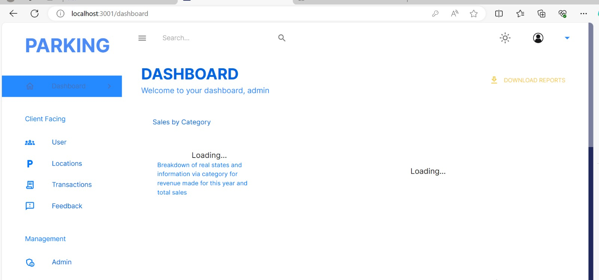

# Smart Parking System

The Smart Parking System is an innovative software solution designed to optimize parking spot utilization and improve the parking experience. It allows users to check parking availability and reserve parking spots in real-time, reducing time spent on parking and improving overall efficiency.

## Features 

- Real-Time Parking Availability: Check the availability of parking slots in real-time.
- Reservation: Reserve your parking slot at your preferred location.
- Alerts: Get reminded when your reservation time is approaching.

## Usage

To check for parking availability, run the application and navigate to the Parking Availability page. Here, you can view the current state of all parking slots.

To reserve a parking slot:

1. Navigate to the Reservations page.
2. Choose your preferred parking slot and reservation timings.
3. Enter Your Licence Number and click on "Book Now" to finalize your reservation.
4. While Exiting the parking Release the slot from the dashboard

## Technology Stack

The Smart Parking System is built using modern web technologies. Our tech stack includes:

- **Front-end:** React for the admin site, and flutter for the mobile application.
- **Back-end:** Express.js for server operations and API endpoints.
- **Database:** MongoDB for data storage.
- **API Communication:** RESTful APIs for frontend and backend communication.
- **IOT Camera:** Python,jupyter.

## Web Application

