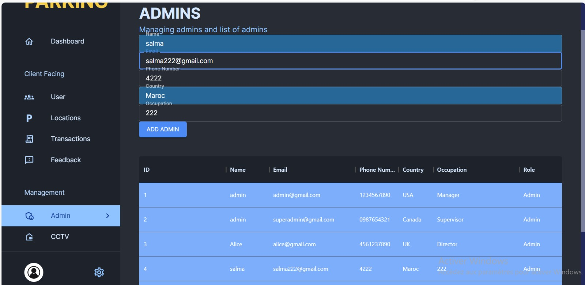

# Smart Parking System

The Smart Parking System is an innovative software solution designed to optimize parking spot utilization and improve the parking experience. It allows users to check parking availability and reserve parking spots in real-time, reducing time spent on parking and improving overall efficiency.

## Features 

- Real-Time Parking Availability: Check the availability of parking slots in real-time.
- Reservation: Reserve your parking slot at your preferred location.
- Alerts: Get reminded when your reservation time is approaching.

## Usage

To check for parking availability, run the application and navigate to the Parking Availability page. Here, you can view the current state of all parking slots.

To reserve a parking slot:

1. Navigate to the Reservations page.
2. Choose your preferred parking slot and reservation timings.
3. Enter Your Licence Number and click on "Book Now" to finalize your reservation.
4. While Exiting the parking Release the slot from the dashboard

## Technology Stack

The Smart Parking System is built using modern web technologies. Our tech stack includes:

- **Front-end:** React for the admin site, and flutter for the mobile application.
- **Back-end:** Express.js for server operations and API endpoints.
- **Database:** MongoDB for data storage.
- **API Communication:** RESTful APIs for frontend and backend communication.
- **IOT Camera:** Python,jupyter.

## Getting Started

Certainly! Here are step-by-step instructions to set up and run your project locally:

### Prerequisites:

 **Node Version Manager (NVM):**
   - Install NVM from [github.com/nvm-sh/nvm](https://github.com/nvm-sh/nvm).
   - Use NVM to install Node.js version 20.22.0: `nvm install 20.22.0`.

   ### Frontend Setup:

1. **Install Node.js and Angular:**
   - Open a new terminal for the frontend project.
   - Ensure NVM is using Node.js version 20.22.0: `nvm use 20.22.0`.
  

2. **Install Frontend Dependencies:**
   - Run the following commands in the frontend project folder:
     ```bash
     npm install
     ```

   - If you encounter errors during installation, use the following command:
     ```bash
     npm install --save --legacy-peer-deps
     ```

3. **Run Frontend:**
   - After installing dependencies, start the Angular development server:
     ```bash
     npm start
     ```


Now, your full-stack project should be up and running locally. If you encounter any issues during setup, check the console logs for error messages and ensure that all dependencies and prerequisites are correctly installed.

## Web Application


<br>
<br>

**L’interface de connexion est conçue pour être simple et efficace, permettant aux utilisateurs de s’authentifier rapidement et en toute sécurité.**
<br>
<br>


<br>
<br>

**Le tableau de bord en version noire offre une alternative visuelle, avec un thème sombre adapté aux préférences des utilisateurs et améliorant la lisibilité dans des environnements
peu éclairés.**
<br>
<br>


<br>
<br>

**Le tableau de bord en version blanche fournit un aperçu des données clés et des statistiques importantes, présenté de manière claire et concise.**
<br>
<br>


<br>
<br>

**L’interface utilisateur est conçue pour être intuitive et conviviale, permettant aux utilisa￾teurs de visualiser et de modifier leurs informations personnelles, ainsi que d’accéder aux diverses fonctionnalités de l’application.**
<br>
<br>


<br>
<br>

**L’interface de liste des parkings affiche une liste des parkings disponibles, avec des informations clés telles que l’adresse, la disponibilité des places, les tarifs horaires, et la distance par rapport à l’utilisateur actuel.**
<br>
<br>


<br>
<br>

**L’interface des transactions est conçue pour offrir une vue détaillée et claire de toutes les
transactions effectuées par l’utilisateur.**
<br>
<br>



<br>
<br>

**Une interface d’administration, souvent désignée sous le terme "admin", est une interface utilisateur conçue spécifiquement pour les administrateurs ou les gestionnaires d’un système, d’une application ou d’une plateforme en ligne .**
<br>
<br>


<br>
<br>

**L’interface CCTV est conçue pour permettre aux utilisateurs de surveiller en temps réel
et de revoir les enregistrements des caméras de surveillance.**

<br>
<br>

## Mobile Application


## Contributors
- Youssef Chahid ([GitHub](https://github.com/Chahid5))
- Salma Daigham ([GitHub](https://github.com/salmasd5))
- Imane Tahri ([GitHub](https://github.com/imanetahri123))
- Zakaria zinaoui ([Researchgate](https://github.com/zakariaZinaOui))